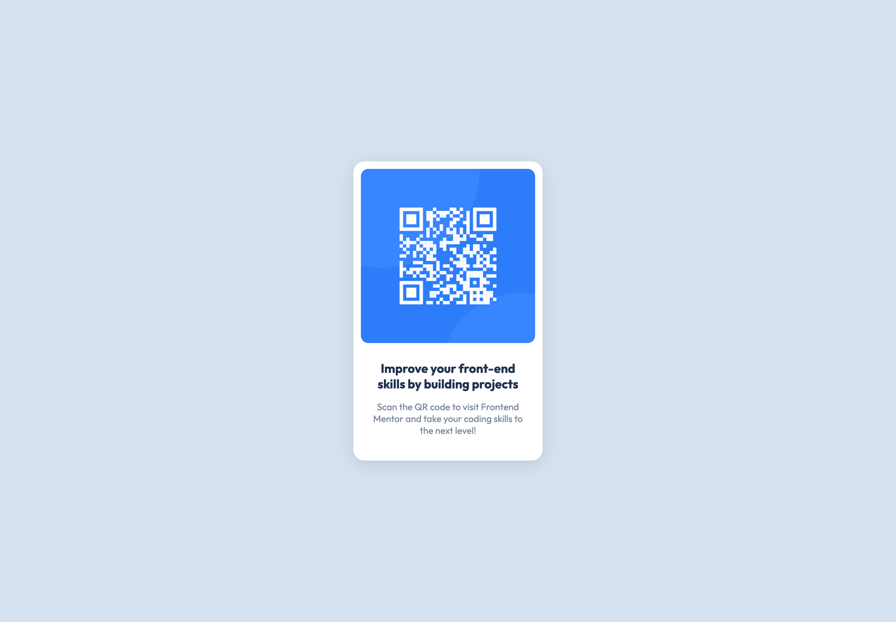

# Frontend Mentor - QR code component solution

This is a solution to the [QR code component challenge on Frontend Mentor](https://www.frontendmentor.io/challenges/qr-code-component-iux_sIO_H).

_Completed on July 18th 2022, completion time 15 min._

## Table of contents

- [Overview](#overview)
  - [Screenshot](#screenshot)
  - [Links](#links)
- [My process](#my-process)
  - [Built with](#built-with)
  - [What I learned](#what-i-learned)
  - [Continued development](#continued-development)
- [Author](#author)

## Overview

### Screenshot

Below are screenshots of both the mobile and desktop version of this page.

### Links

- Solution URL: [Add solution URL here](https://your-solution-url.com)
- Live Site URL: [Add live site URL here](https://your-live-site-url.com)

## My process

### Built with

- CSS custom properties
- Flexbox
- CSS Grid

### Continued development

I would love to continue working on more grid and flexbox combinations making it even easier to create responsive layouts that are more future ready.

## Author

- Frontend Mentor - [@pwillems](https://www.frontendmentor.io/profile/pwillems)
